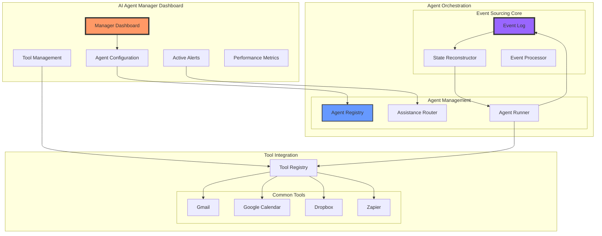

# AI Agent Platform

An enterprise-ready platform for managing, monitoring, and orchestrating AI agents at scale.

## Vision

We help businesses find reliable, enterprise-ready AI solutions that deliver real results. Our platform provides a comprehensive system for managing AI agents that businesses can trust, with built-in oversight, monitoring, and intervention capabilities.

## Core Features

### AI Agent Manager Dashboard
- **Agent Configuration**: Set up and configure different types of AI agents
- **Tool Integration**: Easy integration with common business tools (Gmail, Calendar, Dropbox, Zapier, etc.)
- **Real-time Monitoring**: View all running agents and their current status
- **Assistance Interface**: Provide help to agents through dashboard, email, or SMS
- **Performance Metrics**: Track and analyze agent performance for continuous improvement

### Resilient Architecture
- **Event-Sourced State Management**: Never lose state, always recoverable
- **Multi-Channel Communication**: Dashboard, email, and SMS support for agent assistance
- **Tool Registry**: Secure and monitored access to external services
- **Comprehensive Logging**: Full audit trail of all agent actions and decisions

## Architecture



### Primary Layer - Business Interface
```
Manager Dashboard
├── Agent Configuration
│   ├── Template selection
│   ├── Custom rules setup
│   └── Performance thresholds
├── Running Agents View
│   ├── Active agent list
│   ├── Current state/progress
│   └── Resource usage
└── Assistance Interface
    ├── Help requests queue
    ├── Context viewer
    └── Response interface
```

### Core Layer - Agent Orchestration
```
Event Sourcing System
├── Event Log
│   ├── Agent events
│   ├── State changes
│   └── Assistance requests
├── State Reconstructor
│   ├── Checkpoint management
│   └── State rebuilding
└── Event Processor
    ├── Event handling
    └── State updates
```

### Supporting Layer - Tool Integration
```
Tool Registry
├── Common Tools
│   ├── Gmail
│   ├── Google Calendar
│   ├── Dropbox
│   └── Zapier
└── Integration Features
    ├── Credential Management
    ├── Usage Monitoring
    └── Error Handling
```

## Key Components

### Event Log Structure
- Agent Started
- State Updated
- Tool Accessed
- Assistance Requested
- Task Completed
- Error Occurred

Each event includes:
- Timestamp
- Agent ID
- Event Type
- Event Data
- State Delta
- Context Reference

### Communication Channels
1. **Dashboard**
   - Real-time alerts
   - Context display
   - Direct response interface
   
2. **Email**
   - Formatted updates
   - Response threading
   - Context preservation
   
3. **SMS**
   - Urgent notifications
   - Quick responses
   - Status updates

## Getting Started

### Prerequisites
- Node.js 18+
- PostgreSQL 14+
- Redis 6+

### Installation
```bash
# Clone the repository
git clone https://github.com/yourusername/ai-agent-platform.git

# Install dependencies
cd ai-agent-platform
npm install

# Configure environment
cp .env.example .env
# Edit .env with your settings

# Start the platform
npm run start
```

### Quick Start Guide
1. Access the dashboard at `http://localhost:3000`
2. Set up your first AI agent using the configuration wizard
3. Configure necessary tool integrations
4. Monitor your agent through the dashboard

## Development

### Architecture Principles
1. **Resilience First**
   - Every operation must have a fallback
   - State must be recoverable
   - Resources must be shareable
   - Failures must be isolated

2. **Business Control**
   - Clear visibility into agent operations
   - Direct intervention capabilities
   - Policy enforcement
   - Performance tracking

3. **Resource Efficiency**
   - Shared resources (knowledge bases, tools)
   - Dynamic allocation
   - Cost management
   - Usage tracking

### Adding New Tools
```typescript
// Example tool integration
import { ToolRegistry } from '@/lib/tools';

class CustomTool implements Tool {
  async configure(config: ToolConfig): Promise<void> {
    // Tool configuration logic
  }

  async execute(params: ToolParams): Promise<ToolResult> {
    // Tool execution logic
  }
}
```

## Contributing

We welcome contributions! Please see our [Contributing Guide](CONTRIBUTING.md) for details.

### Development Setup
1. Fork the repository
2. Create a feature branch
3. Make your changes
4. Submit a pull request

## License

This project is licensed under the MIT License - see the [LICENSE](LICENSE) file for details.

## Support

- Documentation: [docs/](docs/)
- Issues: [GitHub Issues](https://github.com/yourusername/ai-agent-platform/issues)
- Discord: [Join our community](https://discord.gg/aiagentplatform)

## Roadmap

### Jan 2025
- [ ] Core dashboard functionality
- [ ] Basic agent management
- [ ] Event sourcing implementation

### Feb 2025
- [ ] Enhanced tool integration
- [ ] Advanced monitoring
- [ ] Multi-channel communication

### Mar 2025
- [ ] Performance optimization
- [ ] Enterprise features
- [ ] Advanced analytics

### Apr 2025
- [ ] AI agent marketplace
- [ ] Custom tool development
- [ ] Enhanced security features
